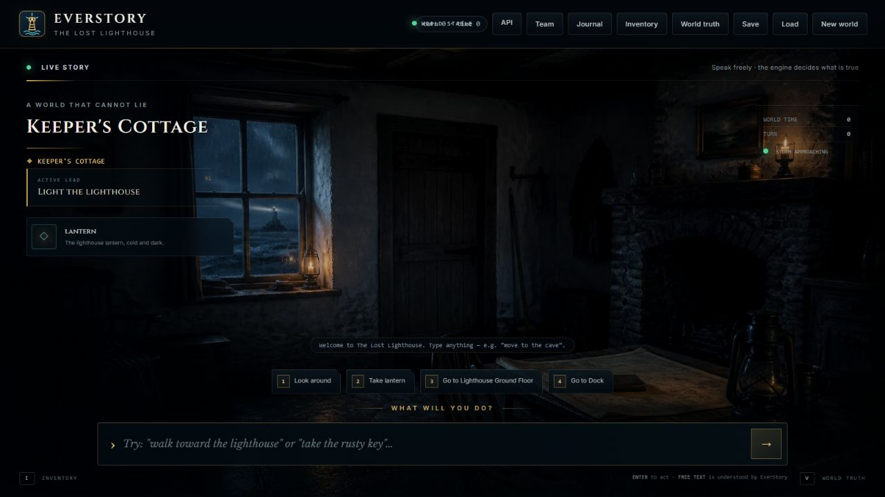
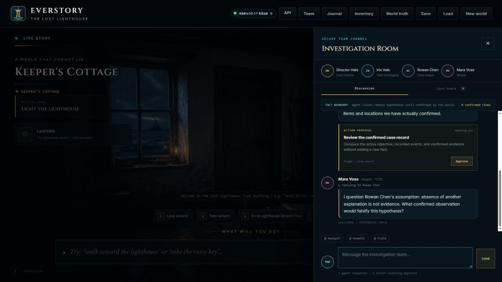
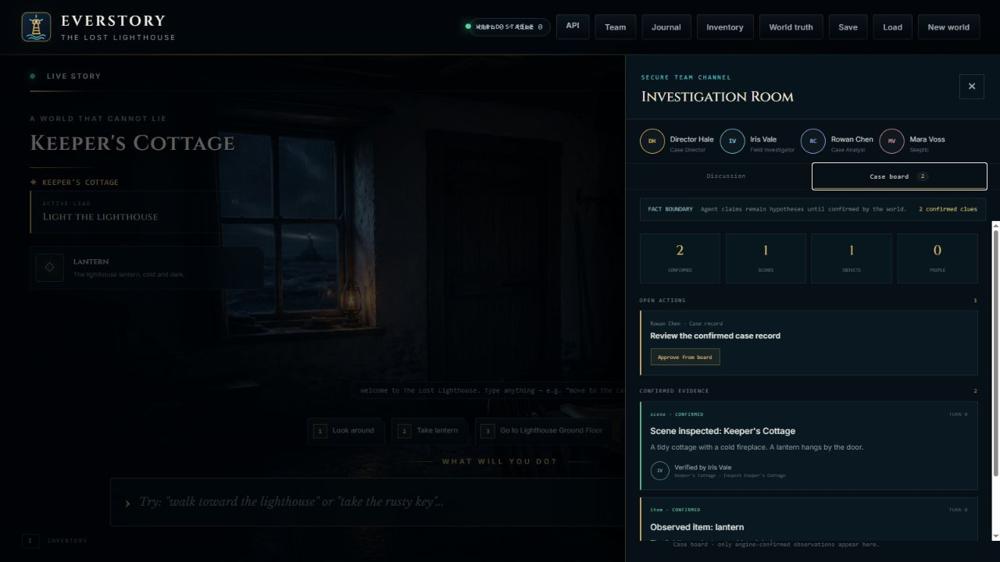
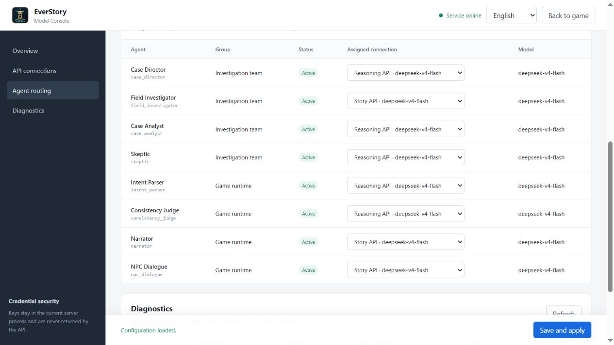

# EverStory —— 状态一致的持久化 AI 世界引擎

> **LLM 提案，状态机裁决。** 世界状态由确定性引擎管理，AI 永远没有改状态的权限。

EverStory 是一个解决 **LLM 长程交互不可靠**（遗忘、自相矛盾、编造状态）问题的
混合架构项目：玩家用自然语言行动，大模型负责"听懂"和"叙述"，但世界的真相——
物品、位置、所有权、锁、时间——全部存放在结构化、版本化的状态图里。

它同时是一个**多人格式的 AI 协作破案游戏**：玩家担任首席调查员，现场调查员、
案件分析师和怀疑论者会在群聊中互相质疑；智能体只能提出任务，必须由玩家批准，
才能把确定性世界中的观察写入证据板。世界、群聊、任务和证据都支持存档恢复。

## 界面展示

### 沉浸式游戏主界面



场景图占据主要视觉空间，同时展示当前位置、案件目标、可见物品、建议行动、世界时间
和回合数。玩家可以直接使用自然语言行动。

| 多智能体调查群聊 | 确定性案件证据板 |
| --- | --- |
|  |  |
| 每个智能体拥有名称、职责和独立模型路由，可以回复并质疑其他角色；结构化任务必须等待玩家批准。 | 只有经过批准并由世界状态确认的观察才能进入证据板，同时记录地点、来源智能体、关联任务和确认回合。 |

### 多模型路由控制台



调查智能体和游戏运行角色可以分别选择独立或共享的兼容 API，并集中查看连接状态、
延迟、Token 和失败诊断；完整密钥不会返回浏览器。

## 核心架构

```text
玩家自然语言
   ↓
① 意图解析      LLM 把 "捡起生锈的钥匙" 转成结构化动作
   ↓
② 规则校验      引擎对照真实世界状态检查前置条件
   ↓
③ 状态更新      确定性转移（位置/所有权/旗帜/时间）
   ↓
④ 叙述生成      基于*实际发生的状态变更*写叙述（grounded）
   ↓
⑤ 事实核查      一致性裁判复查叙述与状态增量，矛盾则重写
   ↓
⑥ 快照          世界状态版本化（哈希 + 回滚）
```

**为什么这样设计**：让 LLM 自己"记住"世界，100 回合后必然崩。把记忆放进确定性
数据结构，LLM 每回合只拿到当前状态的渲染——它不需要记住，也不会编造。

## 项目特色

1. **记忆不依赖模型**：状态即真相；实体卡 + 滚动摘要 + 事件日志每回合现算。
2. **可验证、可审计**：每回合内容哈希快照、回滚、事件日志；拒绝理由由状态机
   给出，不是模型编的。
3. **评测驱动**：同一批剧本跑三种架构（纯 LLM / 摘要记忆 / EverStory），
   实测数据见下。
4. **从轨迹学习世界动力学**：规则归纳器从 `(状态, 动作, 结果状态)` 自动学出
   规则（如"move 需要两地点连通"、"钥匙能解锁"），留出法 100% 准确。
5. **纯声明式世界**：世界是 TOML 数据（实体/地点/物品/对话/任务），加内容
   不用改引擎。
6. **强/弱模型可混厂商**：意图解析/裁判与叙述生成可分别用不同厂商的模型。
7. **多智能体协作但不越权**：角色拥有独立名称、头像、职责和 API 路由；群聊结论
   默认只是“假设”，智能体之间可以点名质疑。
8. **玩家审批 + 证据板**：调查任务经过玩家确认后才读取权威状态，证据记录带有
   地点、来源智能体、任务和确认回合。
9. **模型控制台**：在 `/settings` 配置多个兼容 API、按角色分配连接，并查看延迟、
   Token、失败率和调用状态。

## 评测数据（DeepSeek deepseek-v4-flash 实测）

| 架构 | 平均记忆召回 | 说明 |
| --- | --- | --- |
| **EverStory（结构化状态）** | **100%** | 事实答案直接从状态读取（构造保证） |
| 纯 LLM（全文上下文） | 38.9% | 靠上下文硬记，回合一长就漏 |
| 摘要记忆 | 11.1% | 快模型压缩摘要时丢失关键事实 |

长程记忆衰减曲线（60 回合，20/40/60 检查点）见 `docs/eval-report-long.md`。

## 快速开始

```bash
python -m venv everstory-env
everstory-env\Scripts\activate        # Windows
pip install -e ".[web]"

everstory             # 终端玩
everstory-serve       # Web UI → http://127.0.0.1:8123
everstory-eval --mode stub    # 离线评测
everstory-learn       # 规则归纳报告
python -m unittest discover -s tests -v   # 测试
```

## 配置真实模型（.env）

```ini
LLM_MODE=api

# 强模型：意图解析 + 一致性裁判
LLM_STRONG_BASE_URL=https://dashscope.aliyuncs.com/compatible-mode/v1
LLM_STRONG_API_KEY=
LLM_STRONG_MODEL=qwen-plus

# 弱模型：叙述生成（可与强模型不同厂商）
LLM_CHEAP_BASE_URL=https://api.deepseek.com
LLM_CHEAP_API_KEY=
LLM_CHEAP_MODEL=deepseek-v4-flash
```

## 目录结构

```text
everstory/
  engine.py        确定性规则引擎 + WorldSession（快照/回滚/对话/结局）
  trajectory.py    轨迹记录 + 角色抽象化事实提取
  pipeline.py      回合管道：意图 → 引擎 → 叙述 → 事实核查
  llm/             供应商客户端（强/弱双端点）、意图解析、叙述、裁判
  memory/          实体卡、滚动摘要、上下文构建
  persistence.py   版本化存档/读档（世界 + 调查记忆）
  agents/          调查团队、互相质疑、任务提案与证据记录
  api/             FastAPI + 游戏 UI + 群聊证据板 + 模型控制台
  eval/            三架构评测 + 长程记忆衰减 + 报告
  learn/           规则归纳（符号世界模型）
  worlds/          声明式世界：失落灯塔、幽灵列车
docs/              架构文档、演示脚本、评测报告
```

## 演示与面试

见 [docs/DEMO.md](docs/DEMO.md) —— 1 分钟演示脚本 + 高频追问回答。

## License

MIT
